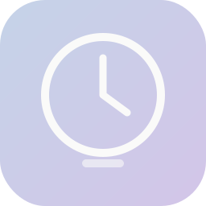

# Timer

A beautiful multi-timer desktop app for Windows 10. Countdowns, stopwatches, presets, custom durations — all running simultaneously with synthesized alarms and native notifications.

Built with Electron, React, TypeScript, and Framer Motion.

<p align="center">
  
</p>

## Features

- **Multiple simultaneous timers** — run as many countdowns and stopwatches as you need
- **Quick presets** — 1, 3, 5, 10, 15, 25, 30, 60 minute one-click timers
- **Custom durations** — mix hours, minutes, seconds or use a simplified minutes-only input
- **Stopwatch mode** — counts up indefinitely with a 60-second repeating progress ring
- **Sound alarm** — synthesized two-tone chime via Web Audio API, configurable duration
- **Desktop notifications** — Windows native toast when a timer finishes
- **System tray** — close to tray, timers keep running in the background
- **Always-on-top** — pin the window above other apps
- **Custom title bar** — frameless window with macOS-style controls
- **Persistent state** — timers and settings survive restarts (paused on reload)
- **Background accuracy** — wall-clock time tracking survives Chromium throttling

## Tech Stack

| Layer | Technology |
|-------|-----------|
| Framework | React 18 |
| Language | TypeScript |
| Desktop | Electron 28 |
| Bundler | Vite 5 |
| State | Zustand (persisted) |
| Motion | Framer Motion |
| Styling | Tailwind CSS |
| Audio | Web Audio API (no files) |

## Development

```bash
# Install dependencies
npm install

# Start dev server with Electron
npm run dev

# Type-check
npx tsc --noEmit

# Build for production
npm run build
```

The dev server runs on `127.0.0.1:5173`. Electron launches automatically with hot reload.

## Project Structure

```
src/
├── main.tsx                 # Entry point
├── App.tsx                  # Root layout
├── components/
│   ├── TitleBar.tsx         # Frameless title bar
│   ├── TimerList.tsx        # Timer collection + empty state
│   ├── TimerCard.tsx        # Individual timer card
│   ├── TimerControls.tsx    # Start / pause / reset / remove
│   ├── TimeDisplay.tsx      # Animated digit readout
│   ├── ProgressRing.tsx     # SVG circular progress
│   ├── AddTimerButton.tsx   # FAB + creation panel
│   ├── AlertDialog.tsx      # Completion dialog
│   └── SettingsPanel.tsx    # Sound & notification settings
├── stores/
│   ├── timerStore.ts        # Timer state (Zustand + persist)
│   └── settingsStore.ts     # Settings state (Zustand + persist)
├── hooks/
│   ├── useTimer.ts          # Tick logic, progress, visibility
│   └── useSound.ts          # Web Audio alarm synthesis
├── types/
│   └── electron.d.ts        # IPC type declarations
└── styles/
    └── globals.css          # Tailwind + custom utilities

electron/
├── main.ts                  # Main process, tray, IPC
└── preload.ts               # Context bridge
```

## Architecture

### Timer lifecycle

Each timer has a `mode` field: `'countdown'` or `'stopwatch'`. The `useTimer` hook drives ticking via `setInterval` at 250ms, but tracks actual elapsed wall-clock time with `Date.now()`. This means timers stay accurate even when the Electron window is backgrounded and Chromium throttles the interval.

- **Countdown** — `remainingSeconds` decrements toward zero. When it hits zero, the store fires `completeTimer`, which sets `alertTimerId` and triggers the alarm + notification.
- **Stopwatch** — `elapsedSeconds` increments from zero. The progress ring uses a 60-second repeating cycle. Stopwatches never complete.

### State persistence

Both the timer store and settings store use Zustand's `persist` middleware with `localStorage`. Timers are serialized in their paused state — `isRunning` is always reset to `false` on restore, and `alertTimerId` is never persisted. This prevents stale alert states from surviving a restart.

### Audio

All sounds are synthesized at runtime via the Web Audio API. No audio files are bundled. The alarm alternates between C6 and G5 tones every 2.5 seconds. A configurable auto-stop duration (5s, 10s, 30s, 1 min, or until dismissed) controls how long the alarm plays.

## Design

The visual language draws from Material Design 3 on Pixel — large typography, generous whitespace, restrained warm earth tones. Motion is intentional: spring animations on interactive controls (toggles, buttons), layout animations on structural changes (adding/removing timers), and digit-level transitions on the time display.

The custom warm palette ranges from `warm-50` (near-white cream) to `warm-900` (deep espresso), with pastel accents for timer cards. The font is Plus Jakarta Sans.

## License

MIT
